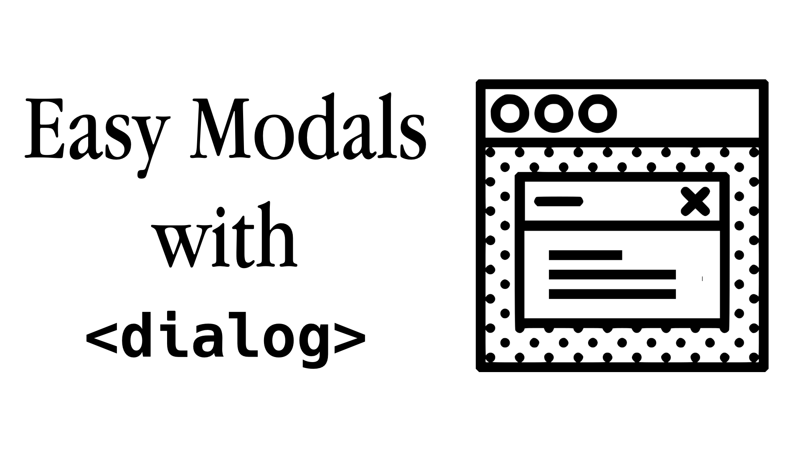

##  Easy Modals using HTML Dialog Element



## What's a Modal?

A modal window is a user interface element that interrupts the users’ workflow and forces the them to interact with it before they can return to the main content.

Think of a small window overlayed  on top of what you were doing, asking you to confirm an action or an alerting you to something urgent.

## Modals without `<dialog>`

In the past, modals have been challenging to implement.
They were one of those things I was likely to reach for someone else's solution or even a framework like Bootstrap to implement. 
Building one from scratch that was accessible and worked well across all browsers was really difficult and time consuming.

A lot of the ways people implemented modals in the past are hack-y, and there's often issues with semantics, tabbing or accessibility, particularly focus trapping.

The HTML `<dialog>` element and `.showModal()`  finally have widespread support with all major browsers, it's time to start using it!

What's great is that it's one of those elements where you get a lot for free. It's not just semantic, it's got special APIs which we will take a look at, as well as some default styling.

You can use `<dialog>` for other interactive elements, but we're just going to focus on using it as a modal. 

## Simple Modal using `<dialog>`

Let's start with a simple modal with a close button:

```html
<dialog id="modal">
  <p>I'm hidden by default!</p>
  <button id="closeModal">Close Modal</button>
</dialog>

<button id="openModal">Open Modal</button>
```

Without the `open` attribute, the dialog element is hidden. To show the dialog as a modal, we need to call `.showModal()` on the dialog element. We use `.close()` to close it.

Let's make some variables to reference our page elements, and add event listeners to the buttons that call the two methods:

```js
const openModalButton = document.querySelector("#openModal");
const modal = document.querySelector("#modal");
const closeModalButton = document.querySelector("#closeModal");

openModalButton.addEventListener("click", function () {
    modal.showModal();
});

closeModalButton.addEventListener("click", function() {
  modal.close();
})
```

And that's all you need to get a basic modal working!

It can be closed with the Esc key and the focus state works as it should when the dialog is opened, with the focus set on the first focusable element inside the `<dialog>`.

## Styling a modal

While browsers apply some default CSS styling to the modal, you can easily customise it further.

Styling the modal itself is as easy as styling a `<div>`:
```css
dialog {
  background-color: pink;
  border: 5px dashed steelblue;
}
```

By default, the overlay behind the modal is grey but we can easily change it using the `::backdrop` pseudo element.

Let's make it yellow, with an opacity of `0.3` so it's still transparent:

```css
dialog::backdrop {
  background-color: rgb(255, 180, 0, 0.3);
}
```

You can take styling your modal way further, and there's no messing around with positioning to worry about!

## Returning a value from a Form

Let's explore how to retrieve values from a form within a modal.

We'll make a new modal with a simple form with one text input.

The form `method` is set to `dialog`. This means submitting the form will close the dialog without submitting data or clearing the form.

```html
<dialog id="modalWithForm">
  <form method="dialog">
    <input type="text" />
        <button formmethod="dialog" type="submit">Cancel</button>
    <button type="submit" id="confirmBtn">Submit</button>
  </form>
</dialog>

<button id="openModalWithForm">Open Modal with Form</button>

<output></output>
```

You can now see how the `input` element is in focus when the modal is opened.

Now on to our event listeners.

We used the `.close()` method in our previous example, but this time we'll pass it a string which will update the `returnValue` of the `dialog`.

We'll add an extra event listener on the `close` event of the `dialog` which will update the `output` element with the `returnValue` so we can see it printed out.

```js
openModalWithFormButton.addEventListener("click", function () {
    modalWithForm.showModal();
});

confirmBtn.addEventListener("click", (event) => {
  modalWithForm.close(textInput.value);
});

modalWithForm.addEventListener("close", (event) => {
if (modalWithForm.returnValue === "") {
outputBox.value = "No return value.";
} else {
outputBox.value = `Return Value: ${modalWithForm.returnValue}.`;
}
});
```

If you don't pass a value to `.close()` the `returnValue` will be the value of the clicked button, so you could make multiple `submit` buttons with different values if you wanted to know which button was clicked:
```html
<button type="submit" value="Canceled!">Cancel</button>
<button type="submit" value="Deleted!">Delete!</button>
```

<hr>

We've used a few of  the `<dialog>` element's special APIs like `.openModal()`  `.close()` and `returnValue` and seen how easy it is to style.

Can you think of any ways to use a modal in your next project?

<hr>

See a demo of the [examples from this article in a CodePen.](https://codepen.io/davidindub/pen/QWZQXqp)

## References
- [MDN Web Docs - HTMLDialogElement](https://developer.mozilla.org/en-US/docs/Web/API/HTMLDialogElement)